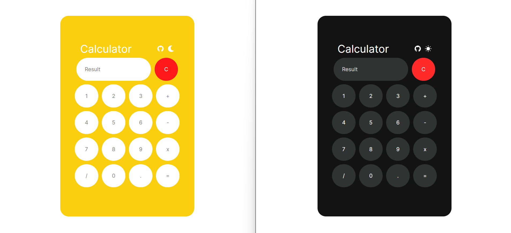

# Calculator App

A simple Calculator built with HTML, CSS, and JavaScript. It features a light mode and a dark mode, providing a visually appealing and user-friendly interface.

## Folder Structure

- `index.html` - The main HTML file.
- `images/` - Contains all the images used in the app.
- `script/` - Contains all the JavaScript code.
- `style/` - Contains all the CSS code.

## Screenshots

## Tech Stack

The following technologies were used in the development of this project:

- HTML
- CSS
- JavaScript
- Favicon

## How to Install

To use the Calculator App locally, follow these steps:

1. Clone the repository from [GitHub](https://github.com/rohan-krishu/Calculator).
2. Open the `index.html` file in your preferred web browser.

## Additional Information

For additional details and updates, please visit the [GitHub repository](https://github.com/rohan-krishu/Calculator).

## Deployed Version

The deployed version of the Calculator App can be accessed [here](https://simplecalcapp.netlify.app/).
